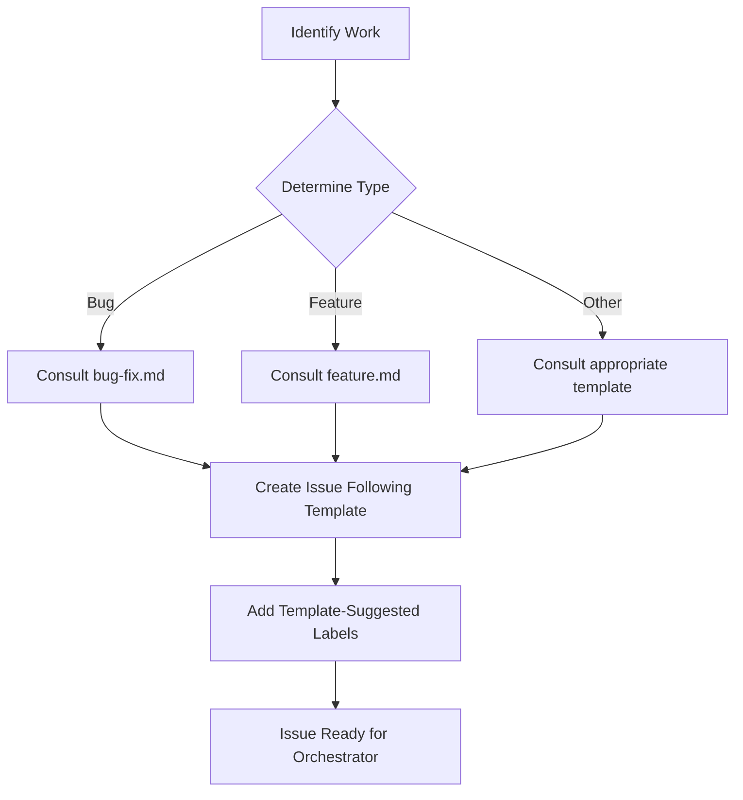

# Beads Item Templates

Pre-defined templates for common work types that provide agents with concrete guidance when creating beads items.

## Available Templates

| Template | Purpose | Issue Type | When to Use |
|----------|---------|------------|-------------|
| [bug-fix.md](bug-fix.md) | Fix defects and bugs | `bug` | Production issues, crashes, incorrect behavior |
| [feature.md](feature.md) | Add new functionality | `feature` | New capabilities, enhancements |
| [refactor.md](refactor.md) | Improve code structure | `task` + `refactor` label | Code quality, technical debt, structural improvements |
| [test-addition.md](test-addition.md) | Add/improve tests | `task` + `tests` label | Coverage improvements, missing tests |
| [documentation.md](documentation.md) | Update documentation | `task` + `documentation` label | README updates, feature specs, code comments |
| [performance.md](performance.md) | Optimize performance | `task` + `performance` label | Slow operations, memory issues, latency improvements |

## What Each Template Provides

Each template includes structured guidance on:

1. **Title Pattern**: Consistent naming convention for issue titles
2. **Priority Guidelines**: How to assess urgency and importance
3. **Expected Files**: Which files typically need modification
4. **Testing Approach**: Required test types and coverage targets
5. **Acceptance Criteria**: Checklist for completion validation
6. **Complexity Guidelines**: Factors affecting effort estimation
7. **Labels to Add**: Appropriate component and work type labels
8. **Example Issue Creation**: Ready-to-use `bd create` commands
9. **Anti-Patterns to Avoid**: Common mistakes and pitfalls

## How to Use Templates

### Manual Issue Creation

1. **Choose the appropriate template** for your work type
2. **Read the template** to understand expectations and structure
3. **Create the issue** using the template's example as a guide
4. **Add labels** as suggested in the template

**Example:**
```bash
# 1. Read bug-fix.md template for guidance
# 2. Create issue following the template pattern
bd create "Fix orchestrator: handle None return from get_ready_work_items" \
  -t bug \
  -p 1 \
  -d "The orchestrator crashes with AttributeError when get_ready_work_items returns None (empty queue). Should handle gracefully and return 'no_work_available' status." \
  --json

# 3. Add labels as suggested in template
bd label add <issue-id> orchestrator bug-fix --json
```

### Autonomous Agent Usage

When agents discover work or create issues, they should:

1. **Determine work type** (bug, feature, refactor, etc.)
2. **Consult corresponding template** for guidance
3. **Follow template structure** when creating the issue
4. **Include all required fields** from the template

**Agent workflow:**
```python
# Agent identifies a bug during code review
work_type = "bug"
template_path = f".pokepoke/templates/bug-fix.md"

# Read template to understand structure and requirements
with open(template_path) as f:
    template_guidance = f.read()

# Create issue following template guidance
issue_cmd = [
    "bd", "create",
    "Fix validation: prevent infinite retry loop on transient errors",
    "-t", "bug",
    "-p", "1",
    "-d", "Detailed description following template structure...",
    "--json"
]
```

## Template Structure

### Common Sections

All templates follow a consistent structure:

#### 1. Title Pattern
Provides format and examples for clear, scannable issue titles.

#### 2. Priority Guidelines
Helps assess appropriate priority level (P0-P3) based on impact.

#### 3. Expected Files
Lists typical file modifications to set clear scope expectations.

#### 4. Testing Approach
Defines required test coverage and quality standards (80%+ enforced by pre-commit).

#### 5. Acceptance Criteria
Provides completion checklist including:
- Functional requirements
- Code quality standards
- Testing requirements
- Documentation needs
- Quality gate validation

#### 6. Complexity Guidelines
Estimates effort based on scope:
- **Low**: Hours
- **Medium**: Days
- **High**: Multiple days
- **Epic**: Weeks (break into subtasks)

#### 7. Labels
Suggests appropriate labels for categorization and filtering.

#### 8. Example Issue Creation
Ready-to-use command examples with realistic scenarios.

#### 9. Anti-Patterns
Common mistakes to avoid for each work type.

## Integration with PokePoke Workflow

### Issue Creation Flow



### Quality Gate Alignment

Templates enforce alignment with pre-commit quality gates:
- **80%+ test coverage** on modified files (enforced by hooks)
- **No linting warnings** (enforced by hooks)
- **All tests pass** (enforced by hooks)
- **Type checking passes** (enforced by hooks)

Agents cannot bypass these gates - templates ensure work is structured to pass validation.

## Template Maintenance

### When to Update Templates

Update templates when:
- New quality gates are added
- Project conventions change
- Common issues emerge from retrospectives
- New tools or workflows are adopted

### How to Update Templates

1. **Identify improvement need** (e.g., new convention, missing guidance)
2. **Create beads issue** for template update
3. **Update template** with new guidance
4. **Review with team** if significant change
5. **Commit changes** following standard workflow

**Example:**
```bash
bd create "Update templates: add git commit message format guidance" \
  -t task \
  -p 2 \
  -d "Templates should include guidance on commit message format (conventional commits). Add section to all templates." \
  --json

bd label add <issue-id> documentation templates --json
```

## Tips for Effective Template Usage

### For Agents

✅ **Do:**
- Read entire template before creating issue
- Follow suggested title patterns for consistency
- Include all required sections in issue description
- Add suggested labels for proper categorization
- Reference template in issue (e.g., "Created using bug-fix template")

❌ **Don't:**
- Skip template consultation for quick issue creation
- Ignore testing or documentation requirements
- Use generic titles instead of template patterns
- Forget to add labels
- Modify templates without creating issue first

### For Humans

✅ **Do:**
- Use templates as guidelines, not rigid requirements
- Adapt templates for unique situations
- Provide feedback on template effectiveness
- Update templates when patterns emerge

❌ **Don't:**
- Blindly follow templates for every edge case
- Skip templates entirely (they provide valuable structure)
- Make templates overly prescriptive
- Let templates become outdated

## Benefits of Template System

### For Agents
- **Concrete guidance**: Explicit expectations reduce ambiguity
- **Consistent structure**: Makes issues predictable and parseable
- **Quality alignment**: Built-in quality gate awareness
- **Reduced errors**: Common pitfalls documented and avoidable

### For Developers
- **Clear expectations**: Know what "done" looks like
- **Reduced rework**: Fewer validation failures
- **Better estimation**: Complexity guidelines aid planning
- **Consistent quality**: Templates encode best practices

### For Project
- **Maintainability**: Consistent patterns easier to maintain
- **Onboarding**: New agents/developers learn conventions faster
- **Quality**: Templates enforce standards automatically
- **Efficiency**: Less back-and-forth on requirements

## Example Workflows

### Bug Discovery and Filing
```bash
# 1. Agent encounters bug during work
# 2. Consults bug-fix template for guidance
# 3. Creates issue following template structure
bd create "Fix beads: race condition in daemon status check" \
  -t bug \
  -p 1 \
  -d "Daemon status check can race with daemon startup, causing false 'daemon not running' errors. Add retry with exponential backoff (3 attempts, 100ms initial delay)." \
  --deps discovered-from:PokePoke-abc123 \
  --json

# 4. Adds labels as template suggests
bd label add <new-issue-id> beads bug-fix concurrency --json

# 5. Agent or orchestrator can now work on the issue with clear guidance
```

### Feature Planning and Implementation
```bash
# 1. Product need identified
# 2. Consults feature template for structure
# 3. Creates feature issue with complete specification
bd create "Add validation: configurable retry limits per gate type" \
  -t feature \
  -p 2 \
  -d "Allow configuring different retry limits for different gate types (e.g., fast gates retry more, slow gates retry less). Add config in .pokepoke/config.yaml under validation.retry_limits with per-gate overrides." \
  --design "Add ValidationConfig dataclass with gate_retry_limits: Dict[str, int]. Update validation runner to check config before retrying. Default to global retry_limit if gate-specific not configured." \
  --acceptance "Config supports per-gate retry limits. Existing behavior unchanged (uses global default). Integration tests verify gate-specific limits work. Documentation updated." \
  --json

# 4. Adds comprehensive labels
bd label add <new-issue-id> validation feature config --json

# 5. Implementation proceeds with clear acceptance criteria
```

## Future Enhancements

Potential template system improvements:
- Template versioning for tracking changes over time
- Template selection prompt in beads CLI (`bd create --template bug-fix`)
- Custom project-specific templates
- Template linting to validate structure
- Analytics on which templates are most used

## Contributing

To add a new template:

1. **Identify need** for new work type template
2. **Create issue** for template addition
3. **Follow existing structure** (see any template as reference)
4. **Include all standard sections** (title pattern, acceptance criteria, etc.)
5. **Add to this README** in templates table
6. **Commit and validate** through standard workflow

## Questions or Issues?

- **Template unclear?** Create issue with `documentation` and `templates` labels
- **Missing template?** Create issue requesting new template type
- **Template outdated?** Create issue for template update
- **General feedback?** Add comment to relevant template file's commit

---

**Template Version:** 1.0  
**Last Updated:** 2026-04-01  
**Maintained by:** PokePoke Project
