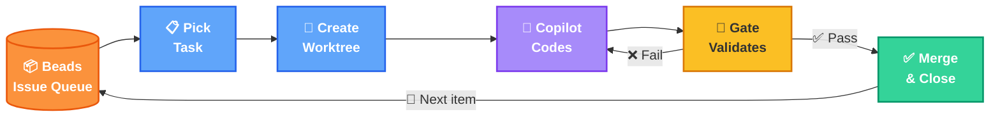
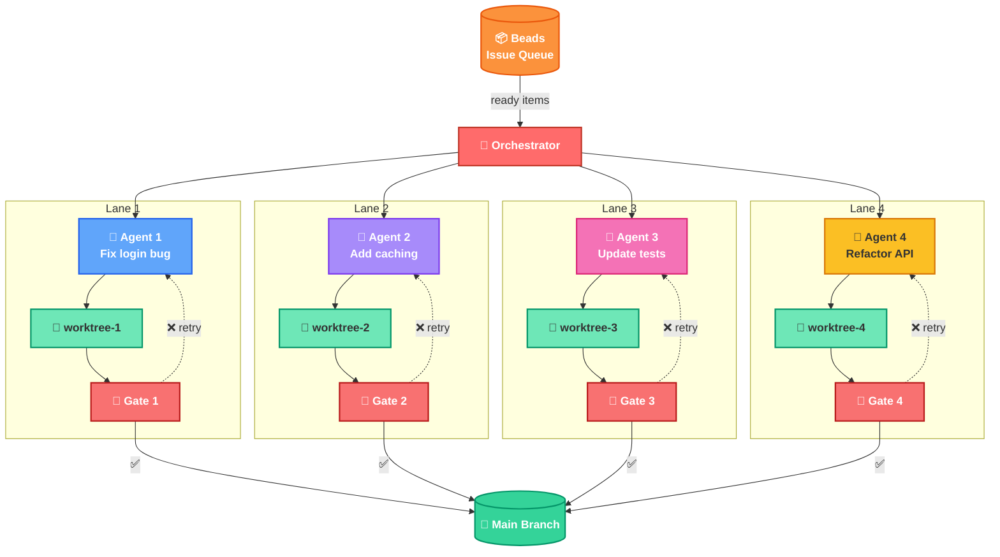
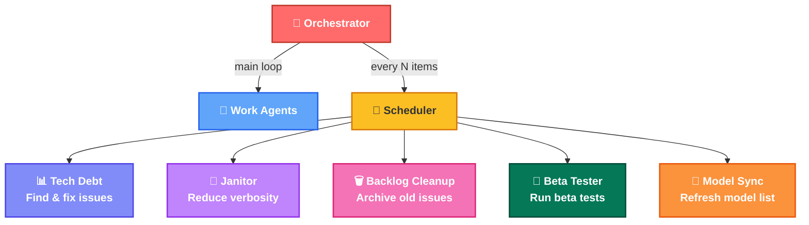

# PokePoke

Autonomous workflow orchestrator that integrates the [Beads](https://github.com/steveyegge/beads) issue tracker with the GitHub Copilot SDK for automated development. Multiple AI agents work in parallel — each in an isolated git worktree — with deterministic quality gates, A/B model comparison, and a shared, git-backed state store.



---

## Installation

### Desktop installer (recommended)

The desktop installer is the easiest way to get PokePoke running on Windows.

**Prerequisites:** Windows 10+, [WebView2 Runtime](https://developer.microsoft.com/en-us/microsoft-edge/webview2/)

1. Build the installer via [packaging/installer/README.md](packaging/installer/README.md), or download from [Releases](https://github.com/AmeliaRose802/PokePoke/releases) if available.
2. Run the installer. If SmartScreen prompts, click **More info** → **Run anyway**.
3. Choose an install location (default: `C:\Program Files\PokePoke`).

To uninstall, use **Add/Remove Programs** in Windows Settings.

### Install from source

```bash
pip install -e .       # Requires Python 3.12+
```

## Usage

```bash
python -m pokepoke --interactive                      # Manual item selection
python -m pokepoke --autonomous                       # Auto-select highest priority
python -m pokepoke --autonomous --continuous           # Loop until queue empty
python -m pokepoke --autonomous --continuous --max-agents 4  # Parallel agents
```

## AI backend configuration

Configure `.pokepoke/config.yaml`:

```yaml
ai_backend:
  provider: copilot        # or claude-code
  copilot_cli_path: copilot.cmd
  claude_code_cli_path: claude
```

## Task tracker backend

PokePoke uses [beads](https://github.com/steveyegge/beads) — a git-backed issue tracker — for work-item management.

| Backend | Binary | Sync strategy |
|---------|--------|---------------|
| **bd** (default) | `bd` | Daemon auto-sync to `beads-sync` branch |
| **br** | `br` | Explicit `br sync` + git push |

Both produce identical JSON; all orchestration works with either.

```python
from pokepoke.beads.beads_query import set_active_backend, BR_CONFIG
set_active_backend(BR_CONFIG)  # Switch to Rust backend
```

---

## Architecture

### Multi-Agent Concurrency Model



The orchestrator runs a `ThreadPoolExecutor` (default ceiling: 8 workers). Each agent operates in a fully isolated git worktree with its own branch. The inner loop per lane is: **code → gate → retry-or-merge**.

Key properties:

- **No shared Python state.** All coordination is through filesystem locks and the beads database. Agents are separate Copilot CLI processes.
- **Dynamic scaling.** `get_effective_max_agents()` reads config at dispatch time; the desktop UI can request additional agents without restarting the orchestrator.
- **Circuit breaker.** After 10 consecutive dispatch failures, the orchestrator pauses to avoid thrashing.
- **Worker naming.** Workers get deterministic snake-icon types based on item-ID hash (e.g., `agent-cobra-worker-1`), mainly for the desktop UI.

### Deterministic Gate Agent

The gate agent is the mechanism that makes autonomous operation viable. Without it, AI agents can declare success on broken code.

**How it works:**

1. After the work agent commits, a **read-only Copilot invocation** (gate agent) runs in the same worktree with `--deny-write`.
2. The gate agent executes the repository's pre-commit quality checks: ruff (syntax/style), mypy (types), pytest with 80% coverage enforcement, file-length limits, and an integrity check that detects tampering of the gate scripts themselves.
3. The gate emits a structured JSON verdict: `{"status": "success|failed", "message": "...", "recommendation": "..."}`.
4. On failure, a cleanup agent receives the specific file list and error context, makes targeted fixes, and the gate re-runs. Up to 10 retries.

**What the gate checks (sequential, early-exit):**

| Check | Tool | Enforced |
|-------|------|----------|
| Script integrity | `verify-integrity.ps1` | Detects gate tampering |
| Syntax + lint | `ruff` (E9xx) | Zero errors |
| Type checking | `mypy` | Zero errors |
| Test coverage | `check-coverage.py` | ≥80% on modified files |
| Skipped tests | `check-skipped-tests.ps1` | None allowed |
| File length | `check-file-length.ps1` | LLM context limits |

The gate scripts live in `.githooks/` and are protected by CODEOWNERS. The pre-commit hook runs an integrity check before any quality check — if an agent modifies the gate scripts, the commit is rejected. This is a defense-in-depth measure: agents cannot cheat the checks.

**Limitation:** The gate agent is read-only and cannot fix issues itself. It depends on the work agent + cleanup agent loop to converge. In practice, convergence requires that work items be scoped small enough that the feedback loop is tractable — large, multi-file refactors are more likely to exhaust retries.

### Maintenance Agents



`MaintenanceScheduler` runs between work cycles, gated by a configurable item-completion threshold. Maintenance agents are distinct from work agents:

- **Singleton-guarded** (Beta Tester, Janitor, Backlog Cleanup, Worktree Cleanup, Model Sync) — only one instance runs at a time via `_running_agents` lock set.
- **Parallel-safe** (Tech Debt, Code Review) — can run concurrently with work agents.

Each agent type has its own frequency (items completed between runs) and per-repo scheduling state persisted to `.pokepoke/maintenance_state.json`.

Notable agents:

| Agent | Purpose | Notes |
|-------|---------|-------|
| **Beta Tester** | Tests MCP tools in isolated worktree | Restarts MCP server first; worktree discarded after |
| **Model Sync** | Discovers new Copilot models | Queries `copilot models list --json`; creates beads issues for new/beta models |
| **Janitor** | Cleans lingering worktrees | Removes unmerged branches past TTL |
| **Backlog Cleanup** | Archives stale issues | Closes items idle beyond threshold |

### A/B Testing Architecture

PokePoke tracks per-model performance and uses the data to inform model selection.

**Model selection hierarchy:**

1. **Assignment rules** — config defines deterministic rules matching issue type, priority, or labels to a specific model. If a rule matches, selection is fixed.
2. **Weighted fallback** — when no rule matches and `fallback: weighted`, candidates are selected probabilistically based on historical success rates.
3. **Fixed fallback** — when `fallback` names a specific model, that model is used.

**What gets recorded** (`ModelCompletionRecord` appended to `.pokepoke/model_stats.json`):

- Item ID, model, gate model, duration, gate pass/fail, input/output tokens, retries, estimated cost, timestamp.
- The raw append-log is never truncated. Summaries (success rate, median duration, cost) are recomputable from data.

**Session summary** — at orchestrator shutdown, a comparison table is printed:

```
🔬 Model Comparison (A/B Testing)
┌─────────────┬─────────┬──────────┬──────────┬────────┐
│ Model       │ Success │ Avg Time │ Items    │ Cost   │
├─────────────┼─────────┼──────────┼──────────┼────────┤
│ gpt-4o      │ 78%     │ 4m 12s   │ 23       │ $1.42  │
│ claude-3.5  │ 85%     │ 5m 01s   │ 18       │ $2.10  │
└─────────────┴─────────┴──────────┴──────────┴────────┘
```

**Limitation:** Weighted selection requires enough history to be meaningful. Early runs are effectively random draws from the candidate pool.

### Desktop Bridge Contract Validation

The desktop frontend (TypeScript + React + pywebview) communicates with the Python orchestrator through an in-process bridge. To prevent silent UI failures from payload shape drift, all bridge payloads are runtime-validated with Zod schemas.

**Architecture:**

```
Python DesktopAPI     pywebview bridge      TypeScript useBridge
dict[str, Any]   →    JSON IPC         →    Zod validation
                                                    ↓
                                            Typed React state
```

**Key benefits:**

- **Fail-fast with actionable errors** — Contract violations surface immediately at the boundary with clear messages like `"stats.elapsed_time: expected number, received string"` instead of crashing deep in rendering code.
- **AI-safe contracts** — Changes to either Python or TypeScript side that break the contract are caught at build time (TypeScript) or runtime (Zod validation).
- **Graceful degradation** — Non-critical paths use safe validation that logs warnings rather than crashing the UI.

**Implementation:**

- `desktop/src/schemas.ts` — Zod schema definitions for all bridge payloads
- `desktop/src/useBridge.ts` — Validation integrated at all API call sites
- `desktop/src/schemas.test.ts` — 32 tests covering valid/invalid payloads

See [docs/bridge_contract_validation.md](docs/bridge_contract_validation.md) for detailed usage and maintenance guide.

### Memory Model: Beads as Shared Store

Agents share no Python-level state. All coordination runs through two channels:

1. **Beads database** (`.beads/beads.db` + `.beads/issues.jsonl`) — the single source of truth for work-item status, assignment, and dependencies. Changes made by any agent are immediately visible to all others (same SQLite file). The JSONL export is git-tracked on the `beads-sync` branch for durability.

2. **Filesystem locks** (`.pokepoke/locks/*.lock`) — cross-process `filelock.FileLock` instances with PID+timestamp metadata sidecars. Stale locks (holder PID dead) are auto-reaped.

This design means agents are just Copilot CLI processes with no shared memory, no message bus, and no coordination server. The filesystem *is* the coordination layer.

### Concurrency Model

**Atomic work claiming** — `assign_and_sync_item()` implements a check-then-act pattern under a per-item file lock:

```
acquire lock("beads-claim-{item_id}")
  → bd show {id}           // read current owner
  → if already assigned → abort
  → bd update --status in_progress -a {agent}
  → bd show {id}           // verify we own it
release lock
```

All beads-mutating commands also serialize through a global `beads-db` lock to prevent SQLite contention.

**Lock inventory:**

| Lock | Scope | Purpose |
|------|-------|---------|
| `beads-claim-{id}` | Per item | Atomic assign |
| `beads-db` | Global | SQLite serialization |
| `worktree-setup` | Global | Serialize `git worktree add` |
| `model-stats-file` | Global | A/B stats append |

**Label-based conflict avoidance** — items labeled `high-conflict-risk` are dispatched only when no other agents are active (solo execution). The dispatcher checks `is_high_conflict_risk(item)` before submitting.

**Double-claiming prevention layers:**

1. Per-item file lock during the claim window.
2. Post-claim verification read (detect-and-abort if we lost the race).
3. Session-level tracking of failed claim IDs — skipped for the remainder of the session.
4. Circuit breaker halts dispatch after 10 consecutive failures.

**Merge safety** — completed work merges from the worktree branch into main via a rebase-then-merge strategy. High-conflict items get a double rebase (before and after merge) with `--no-ff`.

### How PokePoke Differs from GasTown and Similar Orchestrators

PokePoke was built to explore a specific hypothesis: **can a fleet of AI coding agents converge on correct code if the verification is deterministic and the work is properly isolated?**

Most multi-agent coding systems (GasTown, SWE-agent, Devin-likes) treat the AI as both author *and* judge. PokePoke deliberately separates these roles:

| Dimension | Typical agent orchestrator | PokePoke |
|-----------|---------------------------|----------|
| **Verification** | AI self-reports success | Deterministic gate (pre-commit hooks, coverage, types) — machine-checkable, no LLM in the loop |
| **Isolation** | Shared checkout or container | One git worktree per agent — true filesystem isolation, independent branches |
| **State** | In-process or cloud DB | Git-backed issue tracker (beads) — state is versioned, mergeable, survives crashes |
| **Model selection** | Single model, configured | A/B framework with empirical comparison — models earn dispatch weight from tracked outcomes |
| **Conflict handling** | Merge and hope | Label-based conflict avoidance, solo-execution mode, rebase-then-merge strategy |
| **Gate integrity** | Trust the agent | CODEOWNERS + integrity hash on gate scripts — agents physically cannot weaken the checks |
| **Maintenance** | Manual | Scheduled singleton-guarded agents (janitor, beta tester, model sync) run between work cycles |

**Honest limitations:**

- **Work-item granularity matters.** The retry loop converges reliably on small, well-scoped items (single function, single test file). Multi-file refactors frequently exhaust the 10-retry limit because the feedback surface is too large for the cleanup agent.
- **Dependency ordering is manual.** Beads supports `blocks` dependencies, but the human must decompose epics into correctly ordered subtasks. The orchestrator respects the DAG but does not construct it.
- **Gate coverage is Python-specific.** The pre-commit checks (ruff, mypy, pytest) are configured for Python. Non-Python repos require custom gate scripts.
- **No cross-repo coordination.** Each PokePoke instance manages one repository. Multiple instances don't share scheduling or model stats.
- **ThreadPoolExecutor ceiling.** Default 8 parallel agents. Beyond that, diminishing returns from lock contention and merge conflicts.

## Pre-flight Health Checks

Before each work batch, the orchestrator runs health checks to prevent submission to broken environments:

1. **Git status** — clean working tree required
2. **Worktree creation** — test that `git worktree add` works
3. **Lock availability** — stale locks auto-reaped (holder PID dead)
4. **Disk space** — configurable minimum (default 1 GB)
5. **Repository integrity** — orphaned worktree detection

Failures are classified (environmental, recoverable, critical) and the orchestrator attempts self-repair before falling back to graceful shutdown. Configure in `.pokepoke/config.yaml` under `preflight_health`.
