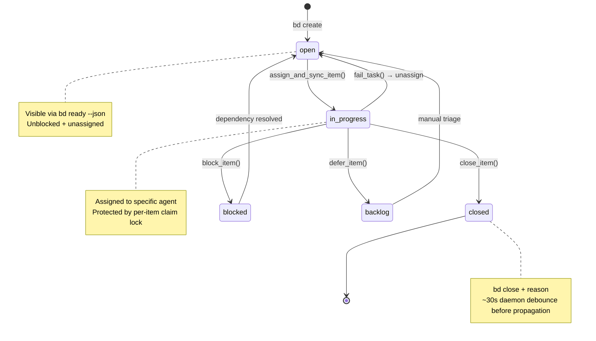
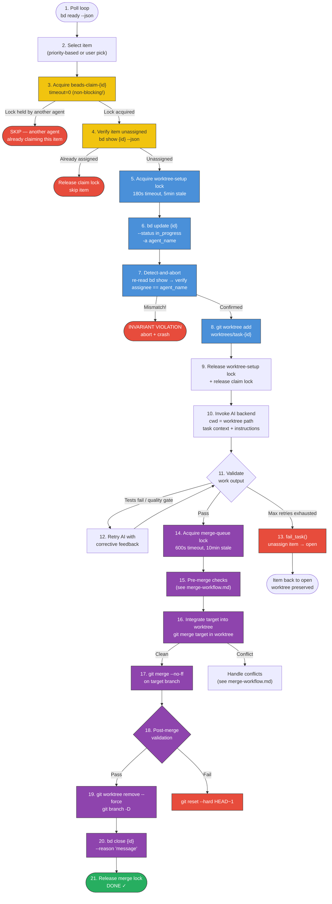
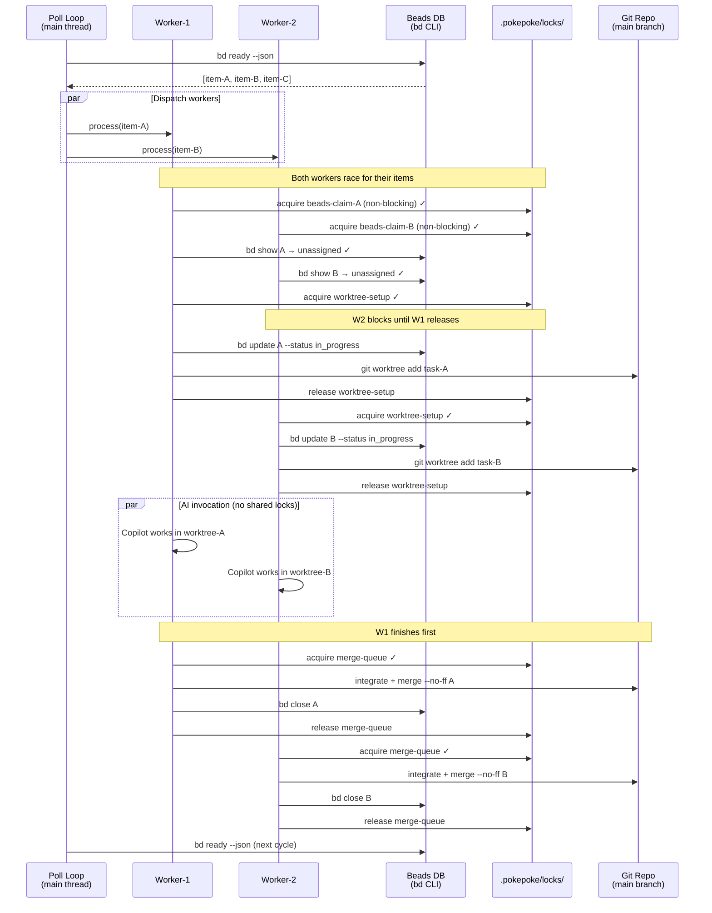
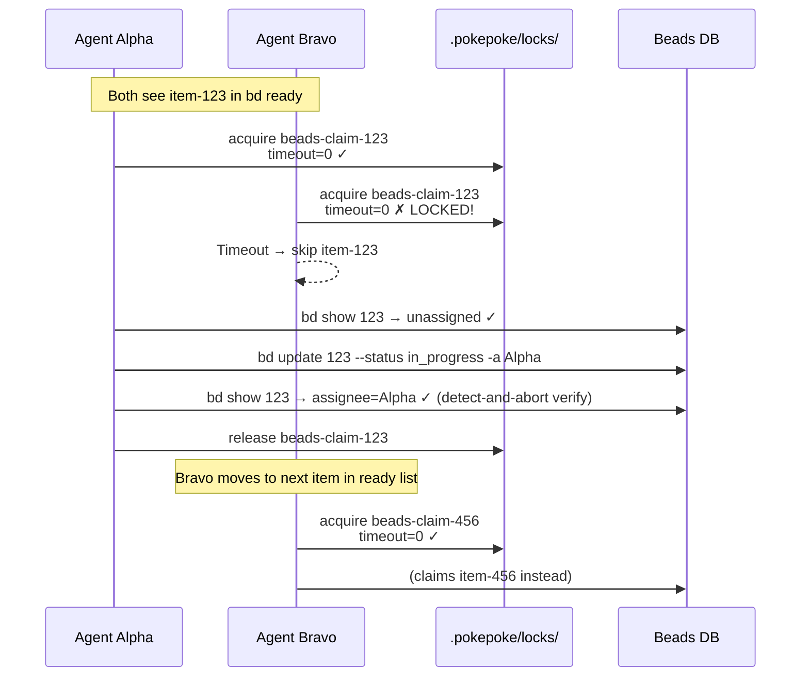
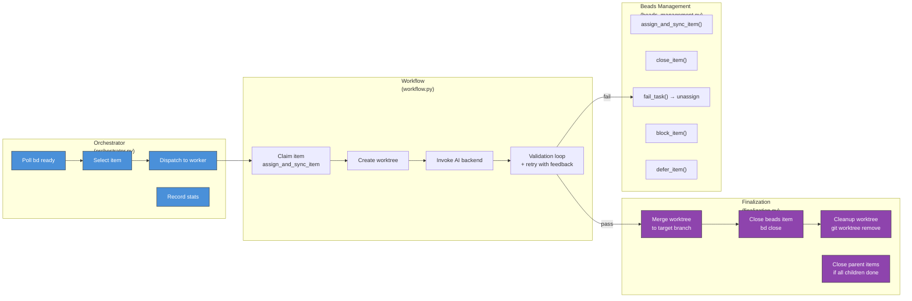
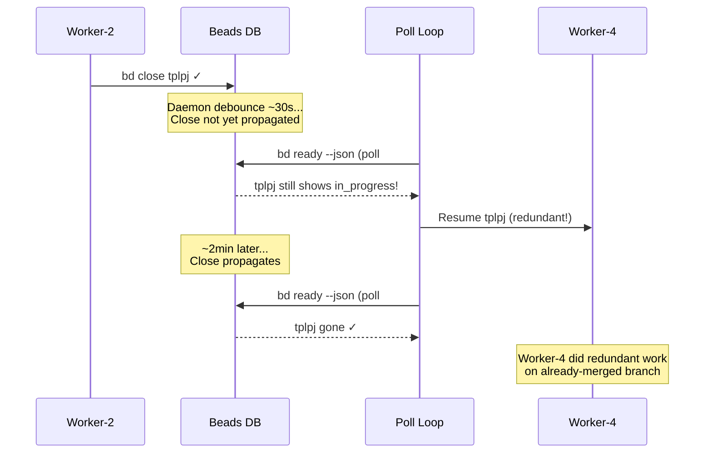

# Beads Work Item Lifecycle & Concurrency Model

Visual diagrams of a beads work item's complete lifecycle — from discovery through completion — including all locks, concurrent agent coordination, and ownership boundaries.

## Work Item State Machine

The complete set of states a beads item can occupy and who triggers each transition.

**Color key:**
- 🟦 Blue = **orchestrator-owned** transition
- 🟪 Purple = **worker-owned** transition
- 🟨 Yellow = **beads daemon** (automatic)
- 🟥 Red = **failure state**
- 🟩 Green = **terminal state**

## End-to-End Item Lifecycle (Single Worker)

The full journey of one work item from poll discovery through merge and closure.

**Color key:**
- 🟦 Blue = **holding worktree-setup lock**
- 🟪 Purple = **holding merge-queue lock**
- 🟨 Yellow = **holding beads-claim-{id} lock**
- ⬜ Default = **no shared lock held**
- 🟥 Red = **failure exit**
- 🟩 Green = **success terminal**

Steps 3–4 (yellow) use the **per-item non-blocking claim lock** — if another agent is already claiming this specific item, we fail immediately (timeout=0) rather than waiting. Steps 5–9 (blue) serialize worktree creation and beads assignment atomically. Steps 14–21 (purple) serialize merges to the target branch. The AI invocation (step 10) runs with **no shared locks held** — only the worktree branch provides isolation.

## Parallel Agent Coordination

How multiple agents interact with the shared beads database and lock system when running concurrently via `ThreadPoolExecutor`.

**Key insight:** The `worktree-setup` lock serializes the critical section of claim + worktree creation but releases before the AI invocation begins. Workers run in parallel during the actual work phase with no shared locks — only their isolated worktree branches provide concurrency safety. The `merge-queue` lock serializes final merges one at a time.

## Double-Claim Prevention (TOCTOU Elimination)

How PokePoke prevents two agents from claiming the same work item, even when `bd ready` returns the same list to both.

The per-item lock is **non-blocking** (timeout=0). The second agent doesn't wait — it immediately moves on. After the `bd update`, the claimer does a **detect-and-abort** re-read to verify the assignment actually took effect (guards against beads CLI failures or races at the database level).

## Lock Inventory

All locks used by PokePoke, their scope, and which operations they protect.

| Lock Name | File | Scope | Timeout | Stale Age | Protects |
|-----------|------|-------|---------|-----------|----------|
| `beads-claim-{id}` | `.pokepoke/locks/beads-claim-{id}.lock` | Per-item | **0s** (non-blocking) | N/A | TOCTOU on item claim |
| `worktree-setup` | `.pokepoke/locks/worktree-setup.lock` | Global | 180s | 5min | `bd update` + `git worktree add` atomicity |
| `merge-queue` | `.pokepoke/locks/merge-queue.lock` | Global | 600s | 10min | Serializes merges to target branch |
| `beads-db` | `.pokepoke/locks/beads-db.lock` | Global | 180s | 5min | Beads mutation commands |
| `worktree-manifest` | `.pokepoke/locks/worktree-manifest.lock` | Global | 30s | 2min | `uncleaned_worktrees.json` read-modify-write |
| `model-registry` | `.pokepoke/locks/model-registry.lock` | Global | 30s | 2min | Warm session pool configuration |
| `_main_repo_git_lock` | *(threading.RLock, in-memory)* | Process | N/A | N/A | Git index.lock contention between poll loop and merge workers |

**Stale detection:** Each file lock writes a `.lock.meta` sidecar with PID + timestamp. On acquisition timeout, the holder PID is checked (`os.kill(pid, 0)` on POSIX, `OpenProcess()` on Windows). If the process is dead, the lock is broken and re-acquired.

## Responsibility Matrix

Which component owns which lifecycle operations.

**Critical rule:** Agents (workers) should NOT call `bd update` or `bd close` directly. The orchestrator and finalization pipeline own all lifecycle transitions. See `AGENTS.md` for details.

## Known Race: Close Propagation Delay

After `bd close`, the beads daemon has a ~30s debounce before the closure propagates. If the poll loop runs before propagation completes, it may see the item as still `in_progress` and re-schedule it.

**Mitigation (fixed):** Removed the `get_in_progress_items()` call from the poll loop entirely (PokePoke-jcdl0). The poll loop now only dispatches items from `bd ready`. Crash recovery for orphaned in-progress items from dead sessions is handled once at startup by `recover_stale_items_for_orchestrator()`.

## Key Files

| Purpose | File |
|---------|------|
| Poll loop & dispatch | `src/pokepoke/orchestrator.py` |
| Single-item workflow | `src/pokepoke/workflow.py` |
| Parallel dispatch | `src/pokepoke/agents/parallel.py` |
| Item claim & close | `src/pokepoke/beads/beads_management.py` |
| Item query (bd ready) | `src/pokepoke/beads/beads_query.py` |
| Lock coordination | `src/pokepoke/worktrees/coordination.py` |
| Worktree creation | `src/pokepoke/worktrees/worktrees.py` |
| Merge pipeline | `src/pokepoke/worktrees/worktree_merge_handler.py` |
| Finalization | `src/pokepoke/worktrees/worktree_finalization.py` |
| Merge details | [merge-workflow.md](merge-workflow.md) |
