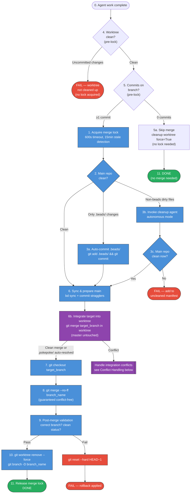
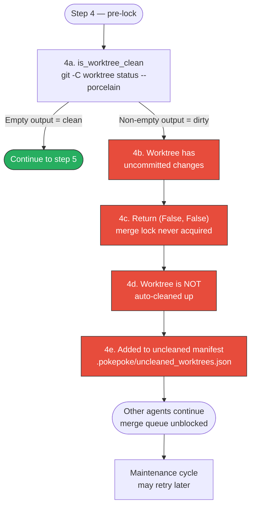
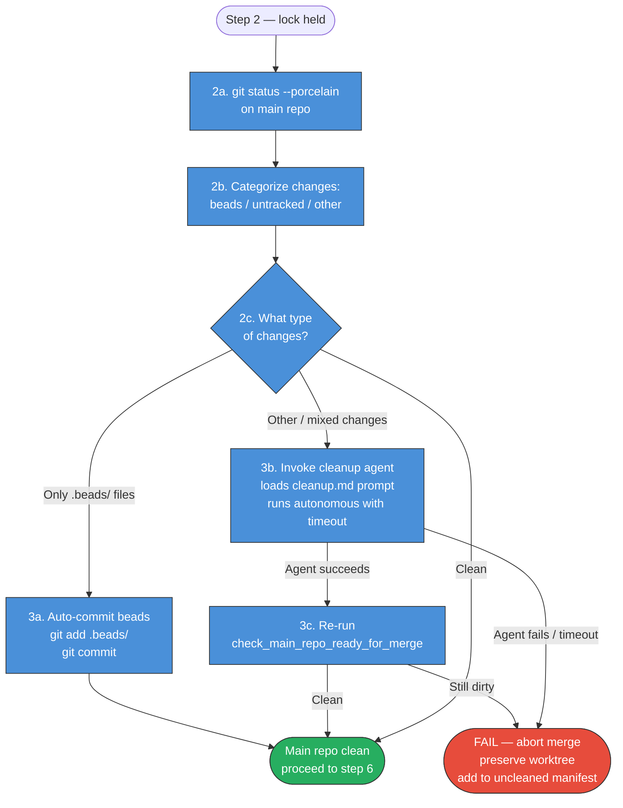
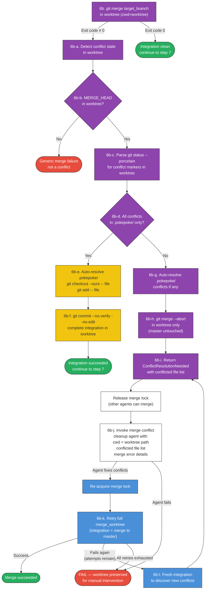
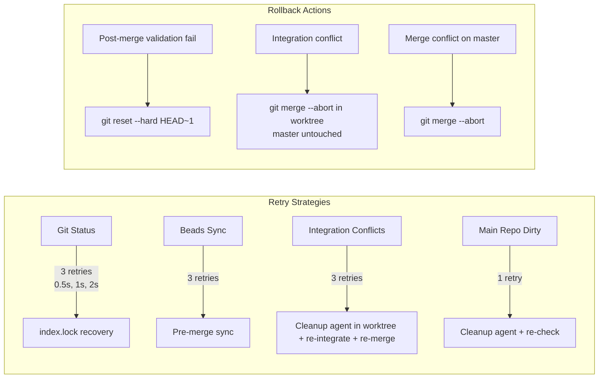

# Merge Workflow

Visual diagrams of PokePoke's worktree merge pipeline — how completed agent work gets merged back to the target branch.

## General Merge Flow (End-to-End)

The full sequence from "agent work complete" to "worktree cleaned up", including lock acquisition, validation, and rollback. PokePoke only performs local merges — the user decides when to push.

**Color key:**
- 🟦 Blue = **holding merge lock** (serialized, one agent at a time)
- 🟪 Purple = **pre-merge integration** (in worktree, under lock — master untouched)
- ⬜ Default = **no lock held** (pre-lock or post-release)
- 🟥 Red = **failure exit** (lock released on exit)
- 🟩 Green = **success terminal**

Steps 4, 5, and 5a run **before** lock acquisition — they are read-only operations on the worktree (isolated per-agent, no shared state). Dirty worktrees and empty branches fail/skip fast without blocking the merge queue. Steps 1–11 (blue/purple) execute under the lock. PokePoke does not push to remote — the user decides when to `git push`.

**Key safety invariant:** Step 6b integrates the target branch INTO the worktree branch *before* the actual merge to master (step 8). After successful integration, the worktree branch is a superset of the target, so step 8 is **guaranteed conflict-free**. If integration fails, only the worktree is dirty — master is never touched. This prevents the catastrophic scenario where `git merge` on master leaves it in a conflicted state.

## Uncommitted Files on Worktree

What happens when the agent's worktree has uncommitted changes at merge time. This check runs **before lock acquisition** (step 4 in the general flow) — dirty worktrees fail fast without blocking the merge queue.

The worktree is preserved for manual intervention or a future maintenance pass.

## Uncommitted Files on Main Repo

What happens when the main repository has uncommitted changes before a merge begins. This corresponds to **step 2** in the general flow.

Known-safe `.beads/` changes are auto-committed. Everything else triggers a cleanup agent. Note: `worktrees/` is gitignored (`.gitignore` line 9), so changes there never appear in `git status`.

**CRITICAL SAFETY:** While step 3b (cleanup agent) is running, new agent spawns are **blocked**. The `create_worktree` function checks `cleanup_lock_active()` and waits (up to 10 minutes) for the cleanup agent to complete before creating new worktrees. This prevents conflicts when the cleanup agent is modifying the main repo working tree. If the cleanup agent doesn't complete within the timeout, the worktree creation proceeds with a warning logged.

## Merge Conflict Handling

How conflicts are detected and resolved during the **pre-merge integration step** (step 6b in the general flow). Conflicts are resolved in the expendable worktree — master is never left in a conflicted state.

**Key design principle:** Conflicts happen in the worktree (purple), never on master. The cleanup agent runs **outside** the merge lock (white) so other agents can merge while conflict resolution is in progress. The retry loop re-acquires the lock (blue) only for the actual merge attempt. Up to 3 retries are attempted (configurable via `max_conflict_retries`).

`.pokepoke/` conflicts (yellow) are always auto-resolved with "ours" strategy since the orchestrator regenerates those files.

## Retry and Rollback Summary

## Key Files

| Purpose | File |
|---------|------|
| Worktree merge | `src/pokepoke/worktrees/worktrees.py` |
| Finalization | `src/pokepoke/worktrees/worktree_finalization.py` |
| Merge handler | `src/pokepoke/worktrees/worktree_merge_handler.py` |
| Merge helpers & integration | `src/pokepoke/worktrees/merge_helpers.py` |
| Helpers | `src/pokepoke/worktrees/worktree_helpers.py` |
| Conflict retry loop | `src/pokepoke/worktrees/merge_conflict_retry.py` |
| Merge execution | `src/pokepoke/git/git_operations.py` |
| Conflict detection | `src/pokepoke/git/merge_conflict.py` |
| Cleanup agents | `src/pokepoke/agents/cleanup_agents.py` |
| Lock coordination | `src/pokepoke/worktrees/coordination.py` |
