# Orchestrator Flow

Visual diagrams of PokePoke's top-level orchestration loop — how work items are fetched, claimed, processed, validated, and finalized.

## Full Orchestrator Loop (End-to-End)

The complete sequence from process start to shutdown, including initialization, work selection, agent invocation, gate review, and merge. Covers both single-shot and continuous modes.

**Color key:**
- � Purple = **AI agent invocation** (work, cleanup, gate, decomposition, maintenance)
- 🟦 Blue = **holding a lock** (worktree-setup or merge lock)
- 🟨 Yellow = **deterministic retry loop** (orchestrator logic, no AI)
- 🟩 Green = **success terminal**
- 🟥 Red = **failure terminal**
- ⬜ Default = **deterministic step** (code logic, CLI commands, git operations)

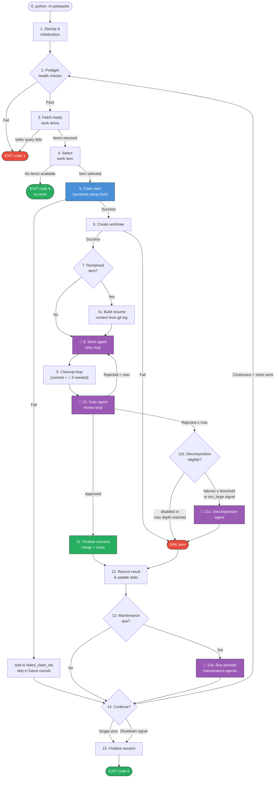

Steps 8–10 (purple, 🤖) are **AI agent invocations** — the work agent, cleanup agent, and gate agent loop until the item passes or retries are exhausted. All other steps are **deterministic** orchestrator logic (git commands, beads CLI, config checks). Step 5 (blue) holds the worktree-setup lock to serialize beads mutations. Finalization (step 11) acquires the merge lock (see [merge-workflow.md](merge-workflow.md) for details).

---

## 1. Startup & Initialization

`_setup_orchestrator()` in `orchestration/orchestrator.py`. Prepares everything the loop needs before processing any work items.

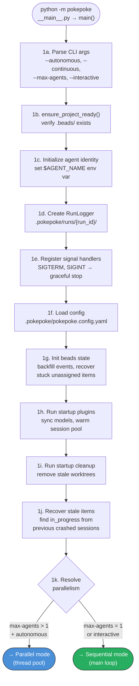

Interactive mode always forces sequential (1 agent). Parallel mode dispatches items to a thread pool — see [Parallel Mode](#parallel-mode) below.

---

## 2. Preflight Health Checks

`_run_preflight()` → `handle_preflight_checks()`. Verifies the environment is sane before fetching work.

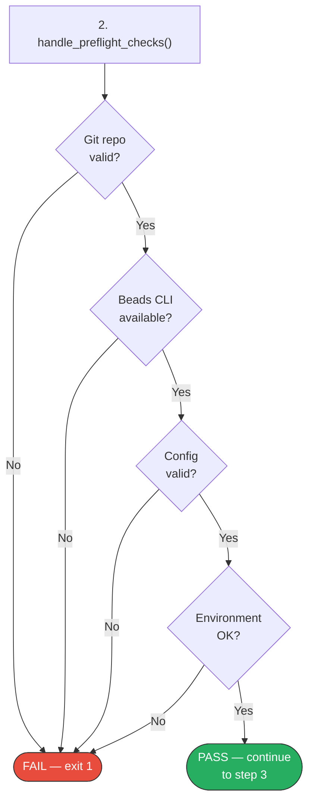

---

## 3. Fetch Ready Work Items

`_fetch_work_items()`. Ensures the main repo is clean, then queries beads for available work.

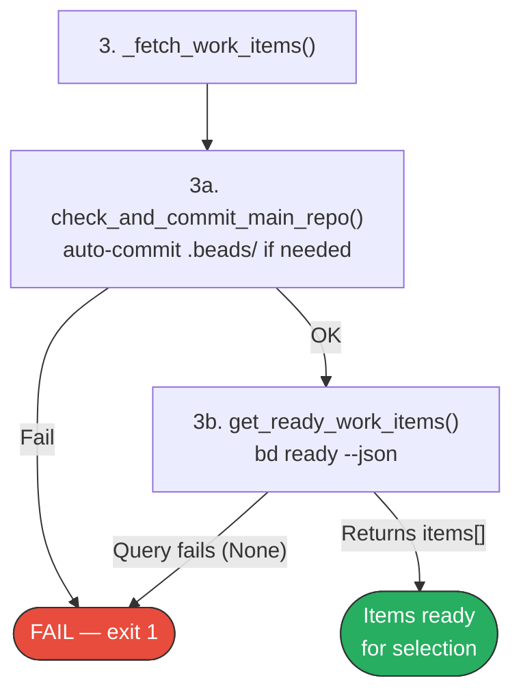

---

## 4. Select Work Item

`select_work_item()` in `orchestration/work_item_selection.py`. Filters and picks the next item to process.

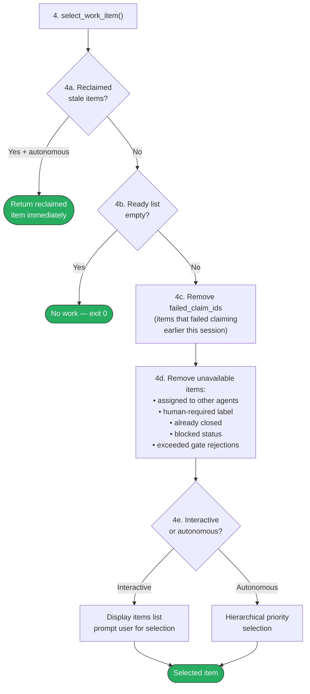

Autonomous selection uses priority-based ordering. Items that exceeded `max_gate_rejections_per_item` (default 5) are silently dropped.

---

## 5. Claim Work Item

`assign_and_sync_item()`. Acquires the worktree-setup lock and marks the item as in-progress in beads.

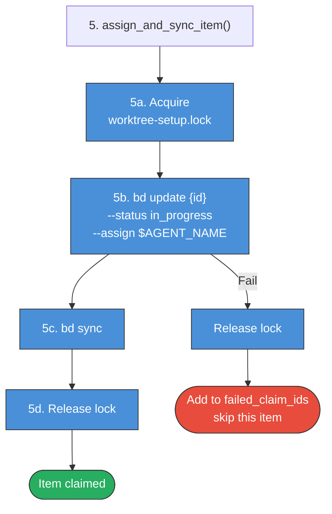

The lock serializes all beads mutations and worktree creation across agents.

---

## 6. Create Worktree

`create_worktree()` in `worktrees/worktrees.py`. Builds an isolated workspace for the agent.

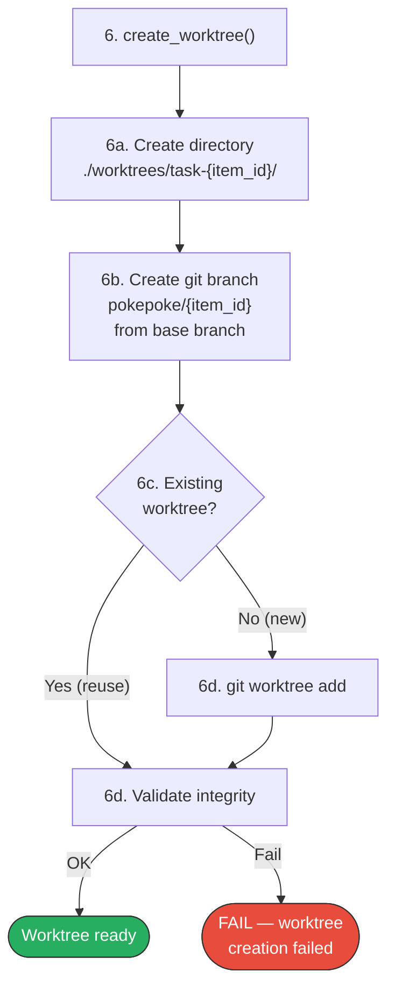

---

## 7. Build Resume Context

For reclaimed items (recovered from a crashed session), the orchestrator extracts previous progress to help the agent continue where it left off.

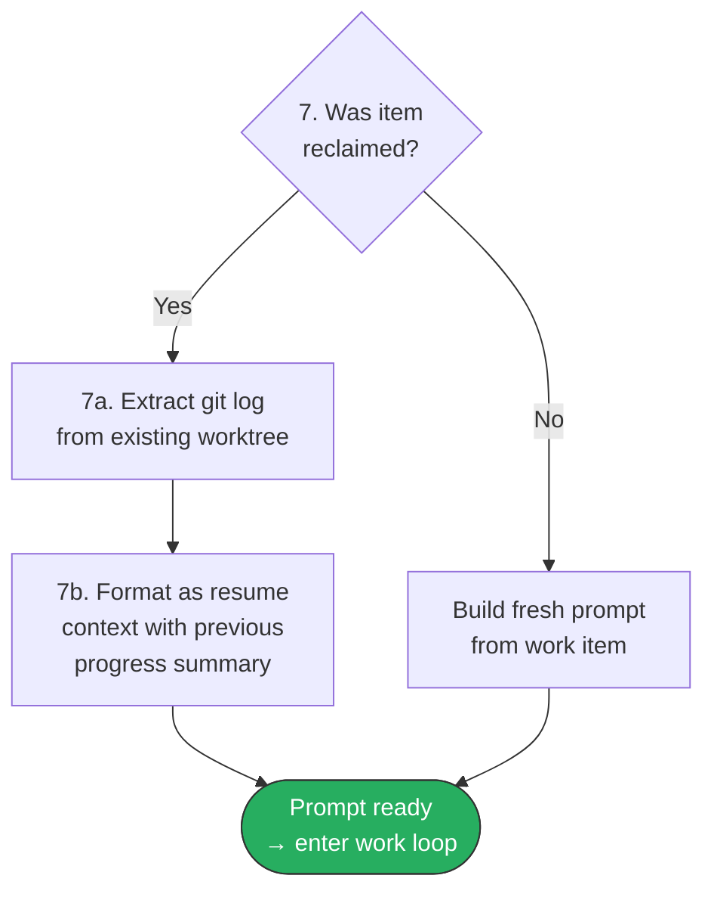

---

## 8. Work Agent Retry Loop

`process_work_item()` in `orchestration/workflow.py`. The core loop that invokes the AI backend with retry and timeout logic.

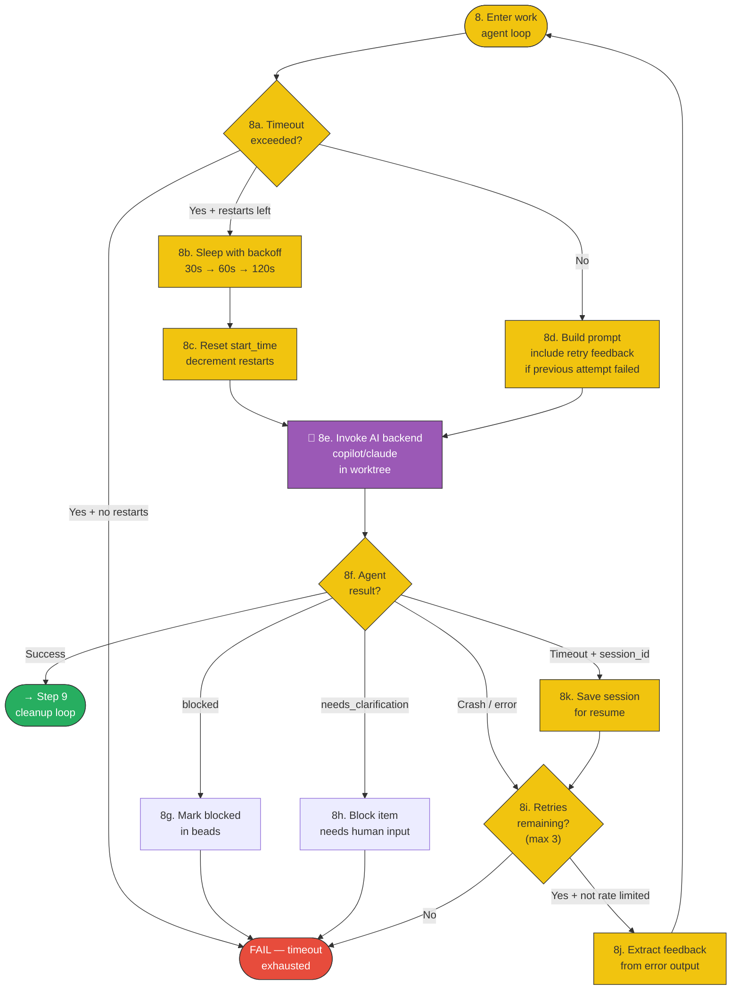

Session resume reuses the same `session_id` so the AI backend can continue from where it timed out rather than starting fresh.

---

## 9. Cleanup Loop

`run_cleanup_with_timeout()` in `orchestration/workflow_helpers.py`. Ensures all work is committed in the worktree before gate review. The loop first attempts a **deterministic** `git commit` (which triggers pre-commit hooks). Only if the commit fails (hooks reject it) does it invoke the **cleanup AI agent** to fix validation errors. If the commit succeeds on the first try, no agent is invoked.

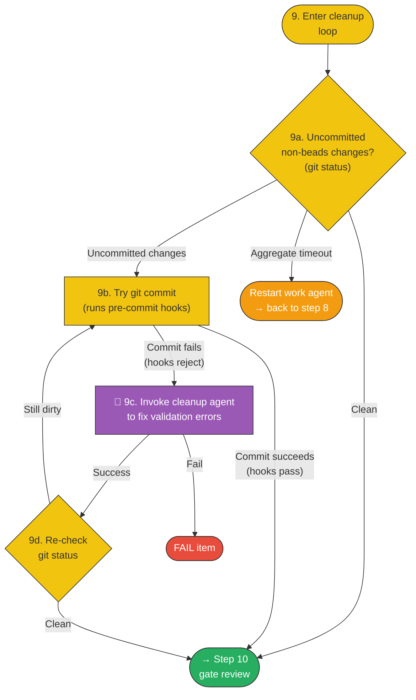

---

## 10. Gate Agent Review Loop

`run_gate_loop()` in `orchestration/gate_agent_loop.py`. A second AI agent validates the work (tests, coverage, quality) before merging.

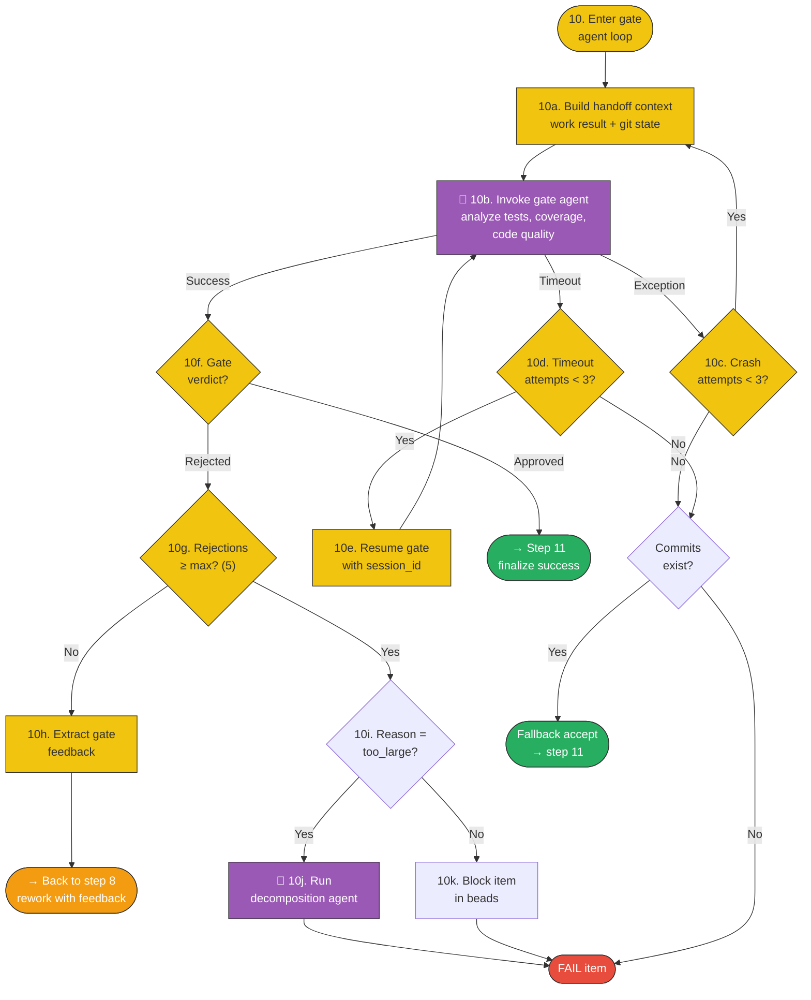

Gate rejections feed back to the work agent as corrective prompts. After `max_gate_rejections_per_item` (default 5), the orchestrator calls `_maybe_decompose()` which checks `should_decompose()`: if total failures ≥ `decomposition_failure_threshold` (default 3) or the work/gate agent signalled `too_large`, and decomposition depth hasn't reached max — the decomposition agent splits the item into sub-tasks. Otherwise the item is just blocked. If the gate itself crashes/times out but commits exist, the orchestrator accepts the work as a fallback.

---

## 11. Finalization

`_finalize_item_result()` in `orchestration/finalization.py`. Merges successful work or records failure.

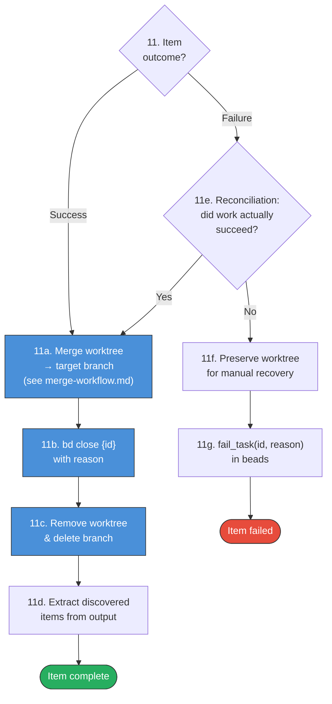

The merge step acquires the merge lock — see [merge-workflow.md](merge-workflow.md) for the full merge pipeline. Reconciliation catches cases where the work agent reports failure but the code was actually committed and passing.

---

## 12. Record Result & Update Stats

`_record_item_result()` in `orchestration/session_lifecycle.py`. Captures metrics for the completed item.

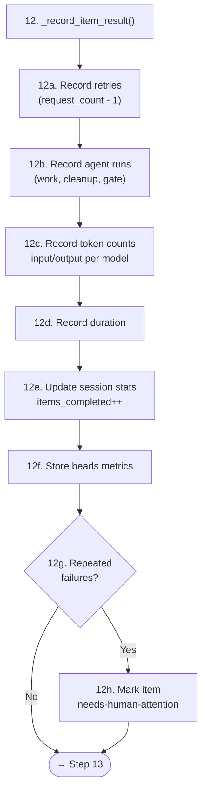

---

## 13. Periodic Maintenance

`run_periodic_maintenance()` in `maintenance/maintenance_scheduler.py`. Triggered after a configurable number of completed items.

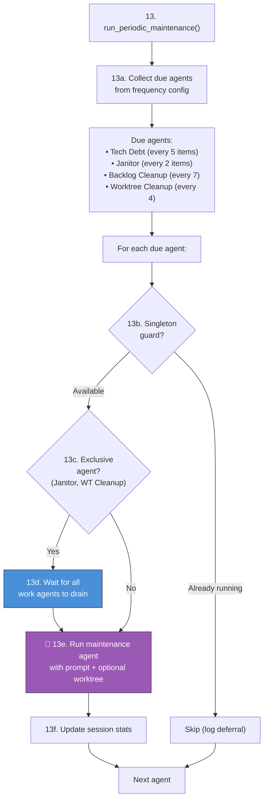

Exclusive agents (Janitor, Worktree Cleanup) wait until all active work agents finish before running, to avoid conflicts on the main repo.

---

## 14. Loop Control

Decision point after each item — determines whether to continue or shut down.

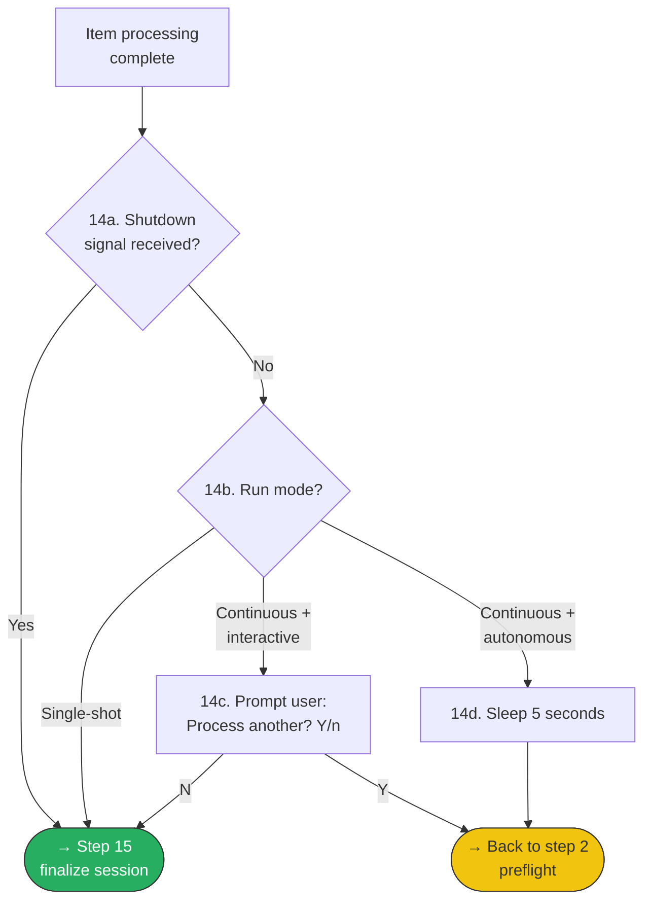

---

## 15. Session Finalization & Shutdown

`_finalize_session()` in `orchestration/session_lifecycle.py`. Wraps up the session and cleans up resources.

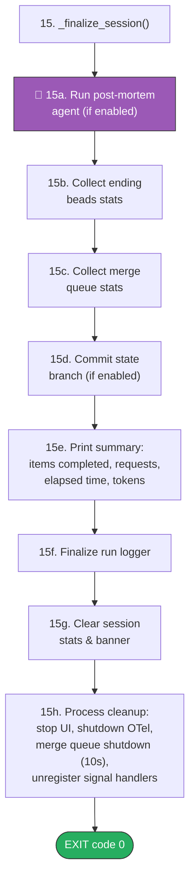

---

## Parallel Mode

When `--max-agents N` (N > 1) is used with `--autonomous`. Dispatches items to a thread pool instead of processing sequentially.

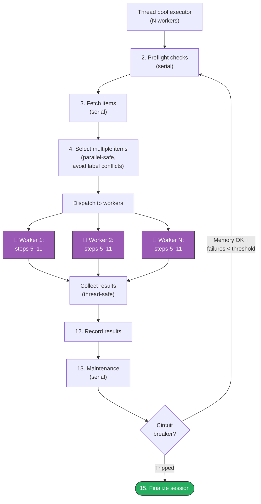

**Concurrency safety:**
- `worktree-setup.lock` serializes beads mutations + worktree creation
- `failed_claim_ids` protected by `threading.Lock`
- Session stats recorded atomically
- Circuit breaker monitors memory pressure and consecutive failures

---

## Retry & Threshold Summary

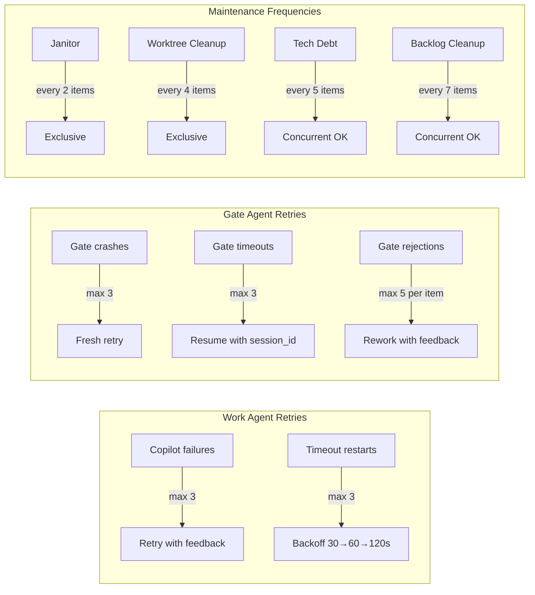

## Key Files

| Purpose | File |
|---------|------|
| Entry point | `src/pokepoke/__main__.py` |
| Orchestrator setup & loop | `src/pokepoke/orchestration/orchestrator.py` |
| Work item processing | `src/pokepoke/orchestration/workflow.py` |
| Workflow helpers (cleanup) | `src/pokepoke/orchestration/workflow_helpers.py` |
| Work item selection | `src/pokepoke/orchestration/work_item_selection.py` |
| Gate agent loop | `src/pokepoke/orchestration/gate_agent_loop.py` |
| Finalization | `src/pokepoke/orchestration/finalization.py` |
| Session lifecycle | `src/pokepoke/orchestration/session_lifecycle.py` |
| AI backend invocation | `src/pokepoke/models/ai_backends.py` |
| Parallel mode | `src/pokepoke/agents/parallel.py` |
| Maintenance scheduler | `src/pokepoke/maintenance/maintenance_scheduler.py` |
| Worktree management | `src/pokepoke/worktrees/worktrees.py` |
| Merge pipeline | `src/pokepoke/worktrees/worktree_merge_handler.py` |
| Signal handlers | `src/pokepoke/utils/signal_handlers.py` |
| Beads integration | `src/pokepoke/beads/beads_query.py` |
