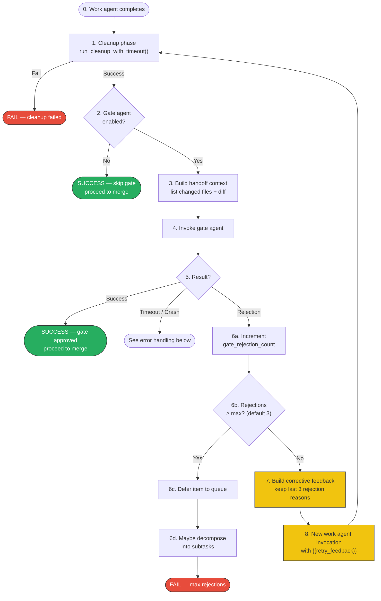
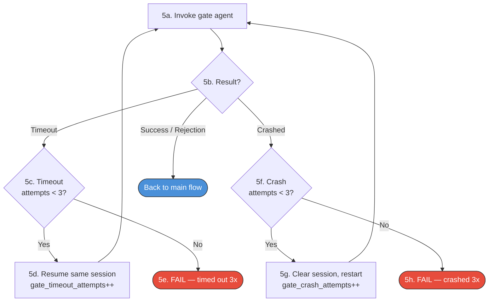
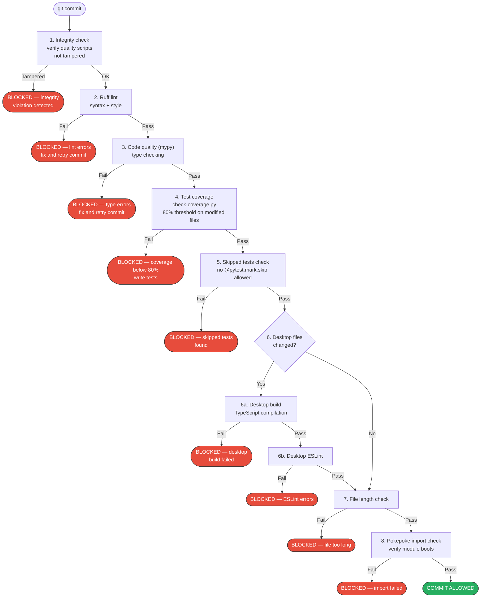
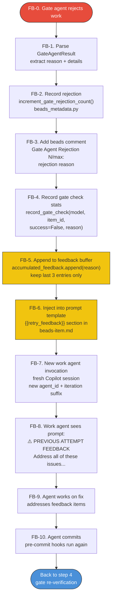
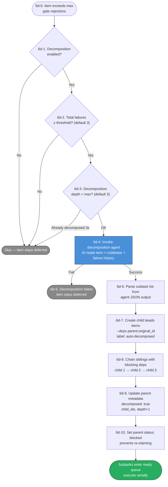
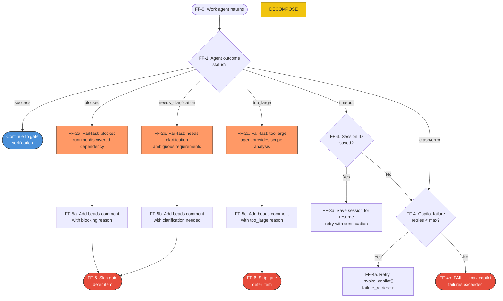

# Quality Gate Validation Loop

Visual diagrams of PokePoke's quality gate pipeline — how agent work is verified and retried with corrective feedback.

## Overview

PokePoke has **two layers** of quality enforcement:
1. **Pre-commit hooks** (`.githooks/`) — automated syntax, type, coverage, lint checks that run on every `git commit`
2. **Gate agent** — AI-powered logic verification that checks whether changes actually satisfy the work item requirements

The gate agent runs *after* pre-commit passes. Pre-commit ensures code compiles and tests pass; the gate agent ensures the code is *correct and complete*.

## General Gate Validation Flow

**Color key:**
- Default = normal execution
- 🟩 Green = success terminal
- 🟥 Red = failure terminal
- 🟨 Yellow = feedback injection (retry path)

### Happy path + rejection loop

The main flow from work agent completion through gate verification to merge. Timeout/crash handling is broken out separately below.

### Gate agent error handling (timeout & crash)

When the gate agent times out or crashes, it retries up to 3 times before giving up. Timeouts resume the session; crashes start fresh.

Steps 7–8 (yellow) are the retry feedback loop — the gate rejection reason is injected into the work agent's next prompt so it can address the specific issues.

## Pre-Commit Hook Pipeline

The automated checks that run on every `git commit` inside a worktree. These are enforced by `.githooks/pre-commit.ps1` and **cannot be bypassed**.

This is a **fast-fail chain** — the first check that fails blocks the commit; remaining checks are skipped.

## Gate Agent Rejection Feedback Loop

Detail of how corrective feedback flows from gate rejection back to the work agent.

## Work Agent Fail-Fast Outcomes

## Item Decomposition (Step 6d)

When an item exceeds its max gate rejections, PokePoke can invoke an AI agent to break it into smaller, independently completable subtasks.

Subtasks inherit parent labels and execute in serial order via blocking dependencies. If subtasks themselves fail, they can be re-decomposed up to 3 levels deep.

## Work Agent Fail-Fast Outcomes

The work agent can return structured outcomes that skip the gate entirely. **Note:** FF-7 (too_large → decomposition) is the proposed flow per PokePoke-dkhkr; currently too_large goes to FF-6 like the other fail-fast outcomes.

## Two Layers Compared

| Aspect | Pre-Commit Hooks | Gate Agent |
|--------|-----------------|------------|
| **What** | Syntax, types, coverage, lint | Logic correctness vs requirements |
| **When** | Every `git commit` | After work agent finishes |
| **Can bypass?** | No — CODEOWNERS protected | Yes — `gate_agent_enabled` config |
| **Runs tests?** | Yes — full pytest on modified files | No — assumes pre-commit passed |
| **On failure** | Blocks commit | Rejects → retry with feedback |
| **Retries** | Infinite (agent keeps trying to commit) | Configurable (default 3) |
| **Fast-fail** | Sequential chain, first failure stops | Structured outcomes skip gate |

## Key Files

| Purpose | File |
|---------|------|
| Main orchestration loop | `_wf_feature.py` |
| Gate agent executor | `src/pokepoke/agents/gate_agent_executor.py` |
| Feedback injection | `src/pokepoke/orchestration/workflow_helpers.py` |
| Rejection count tracking | `src/pokepoke/beads/beads_metadata.py` |
| Configuration | `src/pokepoke/config_types.py` |
| Pre-commit orchestration | `.githooks/pre-commit.ps1` |
| Gate agent prompt | `.pokepoke/prompts/gate-agent.md` |
| Work agent retry section | `.pokepoke/prompts/beads-item.md` |
