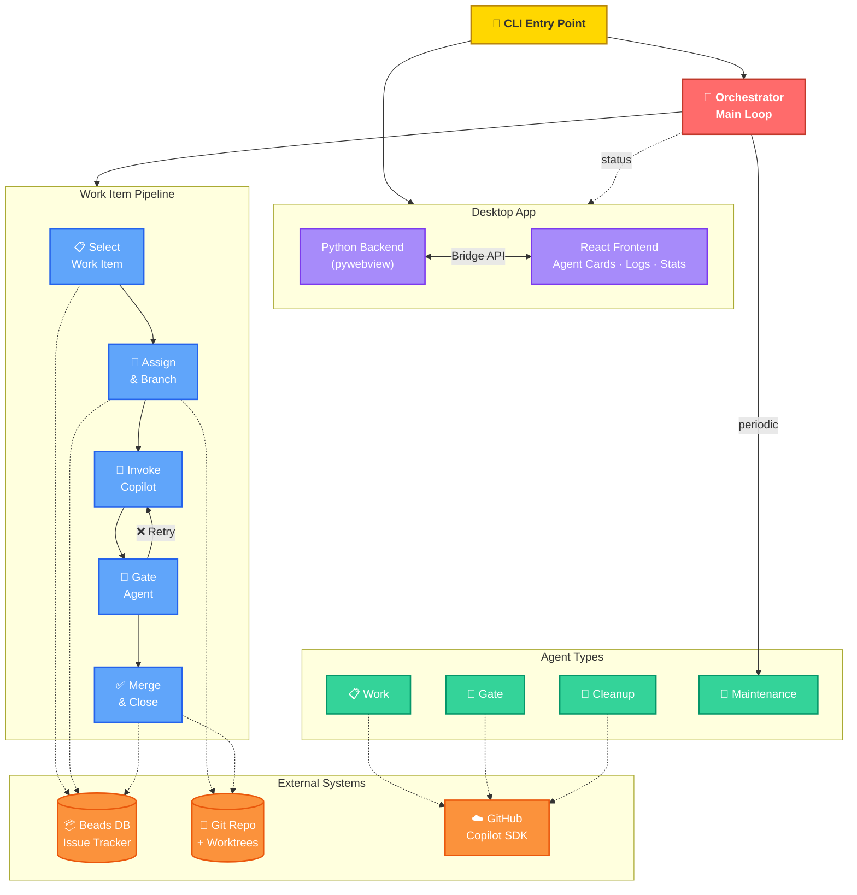

# PokePoke Architecture

## Presentation Diagram

**Color Legend:** 🟡 Entry · 🔴 Orchestrator · 🟣 Desktop UI · 🔵 Pipeline Steps · 🟢 Agents · 🟠 External Systems

**Pipeline flow:** Select → Assign → Invoke Copilot → Gate validation → Merge (retry loop on failure)