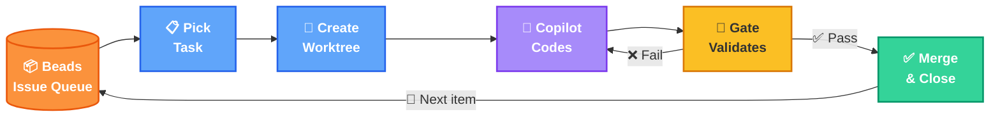
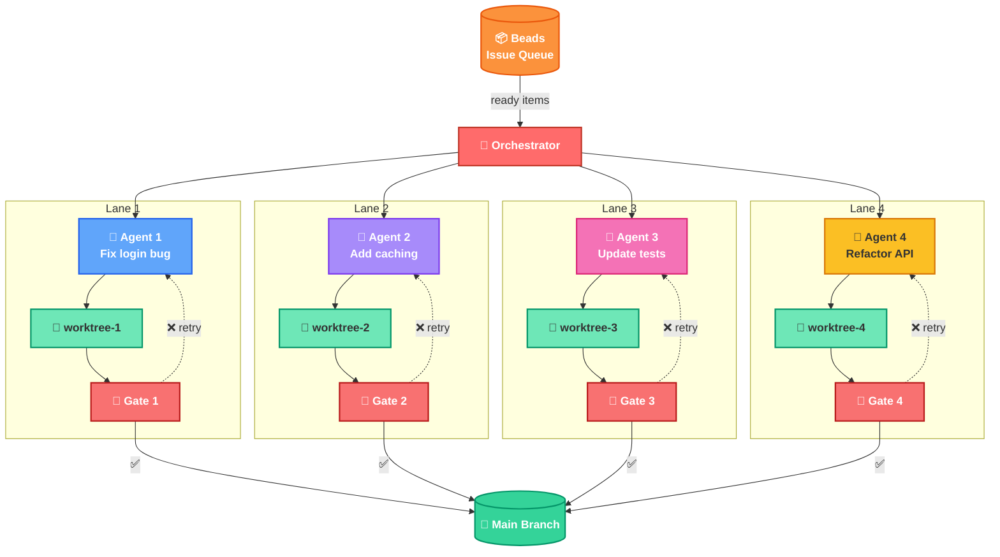
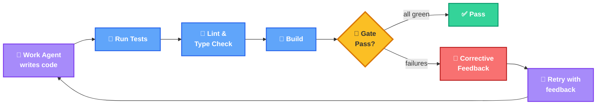

# PokePoke Architecture

**The core loop:** Pick a task from Beads → isolate in a worktree → Copilot writes the code → Gate agent validates → retry or merge → repeat

---

## Parallel Agents

**Parallel execution:** The orchestrator fans out to N agents, each in its own lane: worktree → gate. Pass (✅) merges to main, fail (❌) retries within the lane.

---

## Gate Agent Detail

**Gate validation:** After the work agent finishes, the gate runs tests, linting, and build checks. If anything fails, it generates corrective feedback and the work agent retries. This loops until all checks pass.