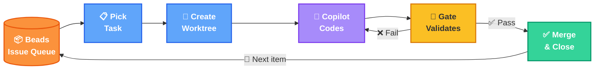
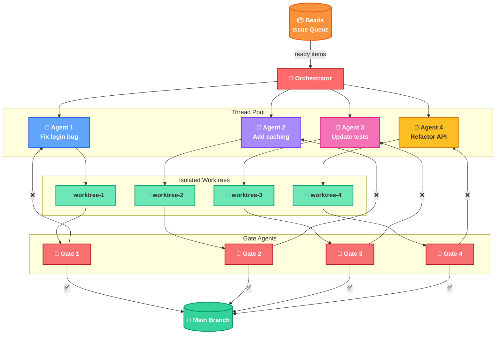

# PokePoke Architecture

**The core loop:** Pick a task from Beads → isolate in a worktree → Copilot writes the code → Gate agent validates → retry or merge → repeat

---

## Parallel Agents

**Parallel execution:** The orchestrator fans out to N agents, each in its own worktree. Gate agents validate each agent's work — pass merges to main, fail retries the work agent.