```mermaid
graph TB
    subgraph Entry["🚀 Entry Point"]
        Main["__main__.py<br/>CLI arg parsing"]
    end

    subgraph UI["🖥️ Desktop UI Layer"]
        DesktopUI["DesktopUI<br/>(pywebview)"]
        DesktopAPI["DesktopAPI<br/>Python↔JS Bridge"]
        Frontend["React/TypeScript Frontend<br/>Agent cards, logs, stats"]
        DesktopUI <--> DesktopAPI <--> Frontend
    end

    subgraph Orchestration["🎯 Orchestration Engine"]
        Orch["orchestrator.py<br/>Main loop"]
        Workflow["workflow.py<br/>Work item pipeline"]
        Selection["work_item_selection.py<br/>Priority scoring"]
        Session["WorkItemSession<br/>RAII resource lifecycle"]
        Orch --> Selection
        Orch --> Workflow
        Workflow --> Session
    end

    subgraph Agents["🤖 Agent System"]
        direction TB
        Work["📋 Work Agent"]
        Gate["🚪 Gate Agent<br/>(validation)"]
        Cleanup["🧹 Cleanup Agent"]
        Parallel["parallel.py<br/>ThreadPoolExecutor"]
        Registry["Agent Registry<br/>(track running agents)"]
        AgentCtx["Agent Context<br/>(thread-local identity)"]
    end

    subgraph AI["🧠 AI Backend"]
        AIBackend["ai_backends.py<br/>Backend selection"]
        CopilotSDK["copilot_sdk.py<br/>Copilot SDK wrapper"]
        ModelSelect["model_selection.py<br/>Model chooser"]
        SDKHelpers["sdk_helpers.py<br/>Prompt building, resume"]
        AIBackend --> CopilotSDK
        AIBackend --> ModelSelect
        CopilotSDK --> SDKHelpers
    end

    subgraph Beads["📦 Beads Integration"]
        BQuery["beads_query.py<br/>bd ready / list"]
        BHierarchy["beads_hierarchy.py<br/>Parent-child tasks"]
        BMgmt["beads_management.py<br/>Assign, close, comment"]
        BRecovery["beads_recovery.py<br/>Stuck assignment recovery"]
        BStats["beads_item_stats_store.py<br/>Completion tracking"]
    end

    subgraph Git["🌳 Git & Worktrees"]
        GitHelpers["git_helpers.py<br/>run_git, verify push"]
        GitOps["git_operations.py<br/>Branch, merge, clean"]
        Worktrees["worktrees.py<br/>Create / cleanup"]
        Merge["worktree_merge_handler.py<br/>Merge back to main"]
        Coord["coordination.py<br/>Filesystem lock"]
        MergeQ["merge_queue.py<br/>Queue & conflict detect"]
        Worktrees --> GitHelpers
        Merge --> GitOps
        Coord --> Worktrees
    end

    subgraph Maintenance["🔧 Maintenance"]
        Scheduler["maintenance_scheduler.py<br/>Singleton-guarded scheduling"]
        TechDebt["📊 Tech Debt Agent"]
        Janitor["🧽 Janitor Agent"]
        BacklogClean["🗑️ Backlog Cleanup"]
        BetaTest["🧪 Beta Tester"]
        WTCleanup["🌲 Worktree Cleanup"]
        ModelSync["🔄 Model Sync"]
        Scheduler --> TechDebt & Janitor & BacklogClean & BetaTest & WTCleanup & ModelSync
    end

    subgraph Prompts["📝 Prompt System"]
        PromptSvc["PromptService<br/>Template rendering"]
        Templates["Templates:<br/>beads-item, gate-agent,<br/>tech-debt, janitor,<br/>beta-tester"]
        PromptSvc --> Templates
    end

    subgraph Stats["📊 Stats & Monitoring"]
        SessionStats["session_stats_registry.py"]
        Journal["session_journal.py<br/>Crash recovery"]
        PerfMon["performance_monitor.py"]
        GateTracker["gate_rejection_tracker.py"]
    end

    subgraph Config["⚙️ Configuration"]
        ConfigLoader["config.py<br/>.pokepoke/config.yaml"]
    end

    subgraph External["☁️ External Systems"]
        BeadsDB[("Beads DB<br/>.beads/beads.db")]
        GitRepo[("Git Repository<br/>+ Remote")]
        CopilotAPI["GitHub Copilot<br/>SDK API"]
    end

    %% Main flow
    Main --> DesktopUI
    Main --> Orch
    Orch -->|parallel mode| Parallel
    Parallel --> Workflow
    Workflow --> Work
    Workflow --> Gate
    Workflow --> Cleanup
    Workflow --> Merge

    %% Agent-AI connection
    Work --> AIBackend
    Gate --> AIBackend
    Cleanup --> AIBackend
    CopilotSDK -.-> CopilotAPI
    PromptSvc --> AIBackend

    %% Beads connections
    Selection --> BQuery
    Session --> BMgmt
    Workflow --> BHierarchy
    BQuery -.-> BeadsDB
    BMgmt -.-> BeadsDB
    BRecovery -.-> BeadsDB

    %% Git connections
    Session --> Worktrees
    Worktrees -.-> GitRepo
    Merge -.-> GitRepo

    %% Maintenance
    Orch -->|periodic| Scheduler

    %% Stats
    Workflow --> SessionStats
    Workflow --> Journal

    %% Config
    ConfigLoader --> Orch
    ConfigLoader --> AIBackend
    ConfigLoader --> Scheduler

    %% UI updates
    Workflow -.->|status updates| DesktopUI
    Registry -.->|agent cards| DesktopAPI
    SessionStats -.->|stats| DesktopAPI

    %% Styling
    classDef external fill:#f9f,stroke:#333,stroke-width:2px
    classDef entry fill:#ff9,stroke:#333,stroke-width:2px
    class BeadsDB,GitRepo,CopilotAPI external
    class Main entry
```

This diagram shows the full PokePoke architecture:

- **Entry** → CLI parses args, launches the Desktop UI and orchestrator
- **Orchestration** → Main loop selects work items, dispatches them through the workflow pipeline (sequential or parallel via ThreadPool)
- **Workflow pipeline** → For each item: assign from Beads → create worktree → invoke Work Agent → validate with Gate Agent → retry on failure → run Cleanup Agent → merge back
- **AI Backend** → Wraps the GitHub Copilot SDK with model selection, prompt building, and session resume
- **Beads** → Git-backed issue tracker providing the ready queue, hierarchy, assignment, and recovery
- **Git/Worktrees** → Isolated worktrees per task with filesystem locking for concurrency safety
- **Maintenance** → Scheduled agents (tech debt, janitor, beta tester, etc.) with singleton guards
- **Desktop UI** → pywebview hosting a React/TypeScript frontend, connected via a Python↔JS bridge for real-time agent cards, logs, and stats