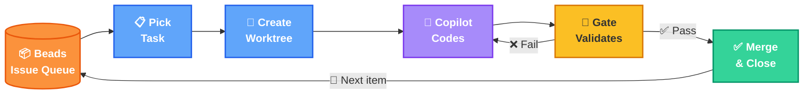

# PokePoke Architecture

```mermaid
graph LR
    Beads[("📦 Beads<br/>Issue Queue")]:::ext
    Select["📋 Pick<br/>Task"]:::step
    Branch["🌳 Create<br/>Worktree"]:::step
    Code["🧠 Copilot<br/>Codes"]:::ai
    Gate["🚪 Gate<br/>Validates"]:::gate
    Merge["✅ Merge<br/>& Close"]:::done

    Beads --> Select --> Branch --> Code --> Gate
    Gate -->|"✅ Pass"| Merge
    Gate -->|"❌ Fail"| Code
    Merge -->|"🔁 Next item"| Beads

    classDef ext fill:#FB923C,stroke:#EA580C,stroke-width:2px,color:#fff,font-weight:bold
    classDef step fill:#60A5FA,stroke:#2563EB,stroke-width:2px,color:#fff,font-weight:bold
    classDef ai fill:#A78BFA,stroke:#7C3AED,stroke-width:2px,color:#fff,font-weight:bold
    classDef gate fill:#FBBF24,stroke:#D97706,stroke-width:2px,color:#333,font-weight:bold
    classDef done fill:#34D399,stroke:#059669,stroke-width:2px,color:#fff,font-weight:bold
```

**The core loop:** Pick a task from Beads → isolate in a worktree → Copilot writes the code → Gate agent validates → retry or merge → repeat